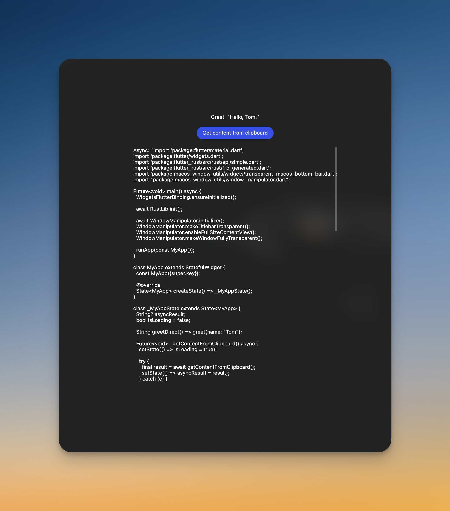

# Flutter🐦 + Rust🦀
Cross platform desktop apps using Flutter as a UI layer & Rust as a backend layer.

<div align="center">
    
</div>

## Building
This project uses `cargo-run-bin` to use `flutter_rust_bridge_codegen` to build from `Cargo.toml` instead of using it globally. This makes sure there's no any "It works on my machine" drama. So make sure to install [cargo-run-bin](https://crates.io/crates/cargo-run-bin) globally:

```
cargo install cargo-run-bin
```
#### Install packages
```
make install
```

### Run Rust <-> Flutter bridge codegen server
```
make frbc.gen.watch
```

### Run app
```
flutter run
```

### Release build
```
flutter build --release
```
